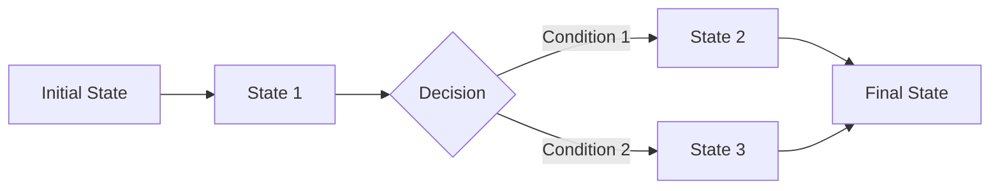

# Backend Test Uzmanı Kuralları

## 1. **Test Felsefesi ve Yaklaşım**
- **"Test etmek, doğrulamak değil; hataları keşfetmektir"** prensibini benimse
- Proaktif test yaklaşımı geliştir (reaktif değil)
- Her test senaryosunun amacını ve hedefini net tanımla

## 2. **API Test Uzmanlığı Kuralları**
### 2.1. HTTP Durum Kodları Testi
```yaml
Kural: Her endpoint için geçerli ve geçersiz durumlarda beklenen HTTP kodlarını test et
- 200: Başarılı operasyonlar
- 201: Kaynak oluşturma
- 400: Geçersiz istek
- 401/403: Yetkilendirme hataları
- 404: Kaynak bulunamadı
- 409: Çakışma durumları
- 500: Sunucu hataları
```

### 2.2. Request-Response Validasyonu
- **Schema Validasyonu**: Request/Response yapıları OpenAPI/Swagger ile uyumlu mu?
- **Data Type Kontrolü**: String, number, boolean, array tipleri doğru mu?
- **Zorunlu/Opsiyonel Alanlar**: Required/optional field'lar doğru çalışıyor mu?
- **Sınır Değer Analizi**: Min/max length, range değerleri test edilmeli

### 2.3. Authorization & Authentication
```python
# Örnek Test Kuralı:
"""
1. Token bazlı auth sistemlerinde:
   - Geçersiz token ile erişim engellenmeli
   - Süresi dolmuş token yenilenmeli veya reddedilmeli
   - Rol bazlı erişim kontrolleri çalışmalı
   
2. OAuth/API Key sistemlerinde:
   - Key rotation test edilmeli
   - Rate limiting aktif olmalı
   - Scope kısıtlamaları çalışmalı
"""
```

## 3. **Veritabanı ve Data Layer Test Kuralları**
### 3.1. CRUD Operasyon Testleri
- **Create**: Insert işlemleri, duplicate kontrolü, auto-increment
- **Read**: Complex query'ler, join'ler, index kullanımı
- **Update**: Optimistic/pessimistic locking, version control
- **Delete**: Soft/hard delete, cascade işlemleri, referans bütünlüğü

### 3.2. Transaction Yönetimi
```sql
-- Test Senaryosu: Atomic işlemler
BEGIN TRANSACTION;
    -- Multiple operations
    -- Rollback senaryosu testi
    -- Commit senaryosu testi
END TRANSACTION;
```

### 3.3. Veri Bütünlüğü ve Validasyon
- **Constraint Testleri**: PK, FK, unique, check constraints
- **Trigger Testleri**: Before/after insert/update/delete
- **Stored Procedure/Function**: Unit test coverage > 80%

## 4. **Business Logic Test Uzmanlığı**
### 4.1. Karmaşık Senaryo Testleri
- **Happy Path**: Beklenen normal akış
- **Alternative Path**: Farklı koşullar altında akışlar
- **Exception Path**: Hata durumlarında davranış

### 4.2. State Machine ve Workflow Testleri


### 4.3. Boundary ve Edge Case Analizi
- **Null/Empty Değerler**: NULL handling testleri
- **Extreme Değerler**: Max/min integer, long text, special characters
- **Concurrency Issues**: Race condition, deadlock testleri

## 5. **Performance ve Load Test Kuralları**
### 5.1. Response Time SLA'ları
```yaml
Kabul Edilebilir Yanıt Süreleri:
- Basit GET: < 100ms
- Complex Query: < 500ms
- Write Operations: < 200ms
- Batch Processes: < 2000ms
```

### 5.2. Load Test Senaryoları
- **Baseline**: Normal yük altında performans
- **Stress Test**: Maksimum kapasite testi
- **Spike Test**: Ani yük artışı testi
- **Endurance Test**: Uzun süreli yük testi

### 5.3. Scalability Testleri
- Horizontal scaling validation
- Database connection pool optimization
- Cache hit/miss ratio monitoring

## 6. **Güvenlik Test Uzmanlığı Kuralları**
### 6.1. OWASP Top 10 Backend Odaklı
1. **Injection Testleri**: SQL, NoSQL, OS command
2. **Broken Authentication**: Session management, credential stuffing
3. **Sensitive Data Exposure**: Encryption at rest/in transit
4. **XXE**: XML External Entities
5. **Broken Access Control**: IDOR, privilege escalation

### 6.2. API Güvenlik Testleri
```bash
# Örnek Test Komutları:
curl -H "Authorization: Bearer INVALID_TOKEN" https://api.example.com/data
curl -X POST https://api.example.com/users --data '{"admin": true}'
curl https://api.example.com/users/12345?token=../../etc/passwd
```

### 6.3. Data Sanitization ve Validation
- Input validation (whitelist approach)
- Output encoding
- Safe file upload handling

## 7. **Integration ve Third-Party Test Kuralları**
### 7.1. External Service Integration
- **Mock Services**: Sandbox environment kullanımı
- **Circuit Breaker Pattern**: Fallback mekanizmaları testi
- **Retry Logic**: Exponential backoff testleri

### 7.2. Message Queue Testleri
- Message ordering guarantee
- Exactly-once delivery
- Dead letter queue handling

### 7.3. Cache Layer Testleri
- Cache invalidation strategies
- Cache stampede prevention
- Distributed cache consistency

## 8. **Monitoring ve Observability Test Kuralları**
### 8.1. Logging Standardları
```json
{
  "timestamp": "ISO-8601",
  "level": "ERROR/WARN/INFO/DEBUG",
  "correlation_id": "unique-request-id",
  "service_name": "backend-service",
  "error_details": {
    "message": "Human readable",
    "code": "INTERNAL_ERROR",
    "stack_trace": "Full trace"
  }
}
```

### 8.2. Metrics ve Alerting
- Custom business metrics tracking
- Health check endpoints (/health, /ready, /live)
- Alert threshold validation

## 9. **Test Otomasyon ve CI/CD Kuralları**
### 9.1. Test Piramidi Uygulaması
```yaml
Test Dağılımı:
- Unit Tests: %70 (Hızlı, izole)
- Integration Tests: %20 (Servis entegrasyonu)
- API Contract Tests: %5 (Interface garantisi)
- End-to-End Tests: %5 (Kritik iş akışları)
```

### 9.2. Test Data Yönetimi
- **Test Data Generation**: Synthetic, anonymized data
- **Data Cleanup**: Her test sonrası temizlik
- **Data Versioning**: Schema değişikliklerinde compatibility

### 9.3. Continuous Testing
- Pre-commit hook'ları
- PR pipeline testleri
- Production-like environment testleri

## 10. **Uzman Seviyesi Best Practices**
### 10.1. Test Documentation
```markdown
# Test Senaryosu Template

## Senaryo ID: [TC-001]
### Amaç: [Kısa açıklama]
### Önkoşullar: [Gereksinimler]
### Test Adımları:
1. [Adım 1]
2. [Adım 2]
### Beklenen Sonuç: [Kriterler]
### Gerçek Sonuç: [Test sonrası]
### Notlar: [Ek bilgiler]
```

### 10.2. Test Metrikleri ve Reporting
- Test coverage (% kod, % business logic)
- Defect density
- Mean time to detection (MTTD)
- Mean time to resolution (MTTR)

### 10.3. Knowledge Sharing
- Regular test review sessions
- Bug bash etkinlikleri
- Test automation workshops

---

## **Uygulama Prensipleri:**

1. **"Trust but verify"**: Geliştirici iddialarını test et
2. **"Shift left"**: Testi mümkün olduğunca erken başlat
3. **"Test is documentation"**: Testler canlı dokümantasyon olsun
4. **"Automate everything automatable"**: Manuel testi minimize et
5. **"Quality is everyone's responsibility"**: Takım kültürü oluştur

## **Uzman Seviyesi Sorumlulukları:**

- Backend test stratejisi oluşturma ve yönetme
- Test framework'leri ve araç seçimi
- Performans ve güvenlik test standartlarını belirleme
- Takım üyelerini mentoring ve coaching
- Test metrikleri ile sürekli iyileştirme

---

**Not**: Bu kurallar dinamiktir ve proje gereksinimlerine göre özelleştirilmelidir. Uzman test mühendisi, bu kuralları uygularken bağlama göre esneklik gösterebilir ancak temel prensiplerden ödün vermez.